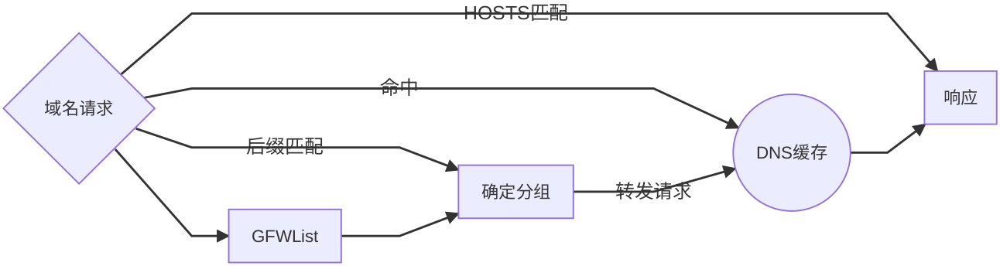
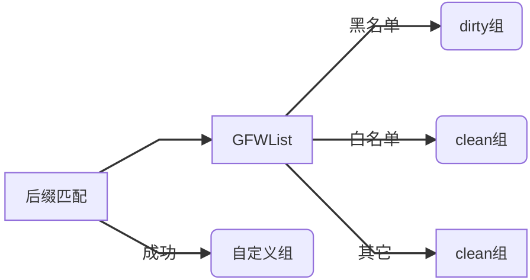

# Telescope DNS
* 支持按域名后缀匹配/GFWList匹配测进行分组
* 支持多hosts文件 + 手动指定hosts
* DNS查询支持socks5代理
* DNS记录缓存
* 自动添加IPSet记录

> 整体结构：
  
> 分组机制：
  

## 使用说明

* 在[release页](https://github.com/wolf-joe/ts-dns/releases)下载软件包；
* 解压后按需求编辑配置文件（可选）后运行进程：
  ```shell
  ./ts-dns
  ```

## 配置示例

> 完整配置文件参见`ts-dns.full.toml`

1. 默认配置（`ts-dns.toml`），开箱即用
  ```toml
  listen = ":53"
  gfwlist = "gfwlist.txt"

  [groups]
    [groups.clean]
    dns = ["119.29.29.29", "223.5.5.5", "114.114.114.114"]

    [groups.dirty]
    dns = [""]  # 省略
    suffix = ["google.com", "twimg.com", "quoracdn.net"]
  ```

2. 使用自定义hosts文件
  ```toml
  listen = ":53"
  hosts_files = ["adaway.txt"]
  # 其余同默认配置
  ```

3. 自定义域名解析
  ```toml
  # 其余同默认配置
  [hosts]
  "www.example.com" = "1.1.1.1"
  ```

4. 使用socks5代理解决DNS污染问题
  ```toml
  # 其余同默认配置
    [groups.dirty]
    dns = ["8.8.8.8", "1.1.1.1"]
    socks5 = "127.0.0.1:1080"
  ```

5. 自定义域名分组
  ```toml
  # 其余同默认配置
    [groups.work]
    dns = ["10.1.1.1"]
    suffix = ["company.com"]
  ```

6. 动态添加IPSet记录（使用前请阅读`ts-dns.full.toml`对应说明）
  ```toml
  # 其余同默认配置
    [groups.dirty]
    dns = [""]  # 省略
    suffix = ["google.com", "twimg.com", "quoracdn.net"]
    ipset = "blocked"
    ipset_ttl = 86400
  ```


## TODO

* DNS响应择优
* DNS缓存预取
* DNS over HTTPS/TLS/TCP等支持

## 特别鸣谢
* [github.com/arloan/prdns](https://github.com/arloan/prdns)
* [github.com/gfwlist/gfwlist](https://github.com/gfwlist/gfwlist)