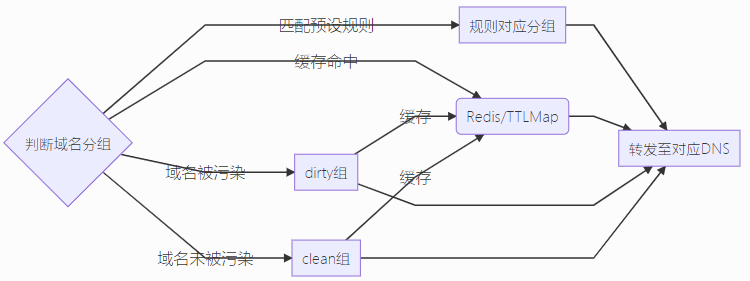

# Telescope DNS
带GFWList & socks5代理 & 反污染功能的DNS分流器


## 编译&使用

```shell
go build -o ts-dns *.go
# ./ts-dns -c ts-dns.toml
./ts-dns
```

## 配置说明


```toml
listen = ":53"

[groups]
  [groups.clean]
  dns = ["119.29.29.29", "223.5.5.5", "114.114.114.114"]

  [groups.dirty]
  dns = ["208.67.222.222:5353", "176.103.130.130:5353"]
  suffix = ["google.com", "twimg.com", "quoracdn.net"]
```

* 配置文件默认为`ts-dns.toml`，当配置文件不存在时使用以上配置。完整配置文件见`ts-dns.full.toml`。
* `gfwlist.txt`参考`https://github.com/gfwlist/gfwlist/raw/master/gfwlist.txt`。
* 反污染功能无法关闭。如不想使用该功能可将`clean`组和`dirty`组中的`dns`设为相同值。
* 当配置了`redis`时，本程序将使用`Redis`作为分组判定结果缓存，反之则使用内置的`TTLMap`作为缓存。
* 污染判定机制尚不完善，目前已知无法正确判定是否被污染的域名如上文`dirty`组里的`suffix`所示。推荐使用`GFWList`实现更好的准确度。
* `dirty`组DNS里的地址推荐设置为自建的`dnscrypt-proxy`（即搭配DOH/DOT使用）或使用`socks5`代理。

## TODO

* GoReleaser
* 智能DNS缓存
* 自动添加IPSET
