# Telescope DNS

[](https://github.com/wolf-joe/ts-dns/releases)
[](https://github.com/wolf-joe/ts-dns/actions/workflows/go.yml)
[](https://codecov.io/gh/wolf-joe/ts-dns)
[](https://goreportcard.com/report/github.com/wolf-joe/ts-dns)


> 灵活快速的DNS分组转发器

## 设计目标
### 灵活解析
* 支持按ABP风格规则/`GFWList`对DNS请求进行分组
* 支持按CIDR对DNS请求进行重定向
* 支持DNS over UDP/TCP/TLS/HTTPS、socks5代理、ECS
* 支持将查询结果中的IPv4地址添加至IPSet
### 快速解析
* 支持并发请求上游DNS，选择最快响应
* 选择ping值最低的IPv4地址（tcp/icmp ping）
* 支持hosts/DNS缓存/屏蔽指定查询类型
* 支持热重载配置文件

## 解析流程


```
查找hosts -> 查找缓存 -> 匹配规则 -> 指定group处理 -> 重定向 -> 设置缓存
```

## 使用说明

1. 在[Releases页面](https://github.com/wolf-joe/ts-dns/releases)下载对应系统和平台的压缩包；
2. 解压后按需求编辑配置文件`ts-dns.toml`（可选）并运行进程：
  ```shell
  # ./ts-dns -h  # 显示命令行帮助信息
  # ./ts-dns -c ts-dns.toml  # 指定配置文件名
  ./ts-dns
  kill -SIGHUP <PID> # 重载配置文件
  ```

## 配置示例

> 完整配置文件参见`ts-dns.full.toml`

1. 默认配置（`ts-dns.toml`），开箱即用
  ```toml
  listen = ":53"

  [groups]
    [groups.clean]
    dns = ["223.5.5.5", "114.114.114.114"]
    concurrent = true

    [groups.dirty]
    dns = [""] # 省略
    gfwlist_file = "gfwlist.txt"
  ```

2. 选择ping值最低的IPv4地址（启用时建议以root权限运行本程序）
  ```toml
  # ...
  [groups.clean]
    dns = ["223.5.5.5", "114.114.114.114"]
    fastest_v4 = true
  # ...
  ```

3. 指定hosts文件和自定义hosts
  ```toml
  # ...
  hosts_files = ["adaway.txt"]
  [hosts]
  "www.example.com" = "1.1.1.1"
  # ...
  ```

4. 使用socks5代理转发DNS请求
  ```toml
  # ...
    [groups.dirty]
    socks5 = "127.0.0.1:1080"
    # ...
  ```

5. 转发至上游DNS时默认附带指定ECS信息（暂不支持DOH）
  ```toml
  # ...
    [groups.clean]
    ecs = "1.2.4.0/24"
    # ...
  ```

6. 自定义域名分组
  ```toml
  # ...
    [groups.work]
    dns = ["10.1.1.1"]
    rules = ["company.com"]
    # ...
  ```

7. 动态添加IPSet记录（使用前请阅读`ts-dns.full.toml`对应说明）
  ```toml
  # ...
    [groups.dirty]
    ipset = "blocked"
    ipset_ttl = 86400
    # ...
  ```


## 未来规划

- [ ] 支持定期拉取最新gfwlist
- [ ] 支持http接口管理
- [ ] 降低gfwlist的匹配优先级
- [ ] DoT/GFWList域名解析自闭环

## 特别鸣谢
* [github.com/arloan/prdns](https://github.com/arloan/prdns)
* [github.com/gfwlist/gfwlist](https://github.com/gfwlist/gfwlist)
